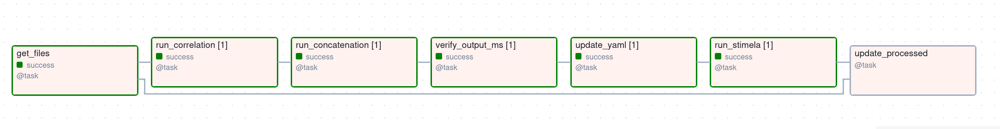

# End-to-end Data Processing Pipeline for COMACT Meerkat Data

An Apache airflow based end-to-end imaging pipeline for the COMPACT data. Under the hood pipeline uses the [standard DZA based correlator](https://gitlab.dzastro.de/dza/data-science/standard-correlator) and the [Stimela](https://github.com/caracal-pipeline/stimela.git). Airflow is used for scheduling and orchestration of batch jobs. The compute engine of the pipeline utilize the HPC resources through the SLURM scheduler. Alternatively, the pipeline can be modified to use compute resources through Kubernetes.

A rough sketch and installation procedures of the pipeline are defined in the pipeline_documentation.pdf available within this repo. The schema of the pipeline looks as follows:

The output of each task are stored in the Xcom feature within Airflow.
The different tasks within the pipeline are defined as DAGs within the airflow:

    This DAG contain tasks which
    1. Collect filenames (voltage .dada files) of different frequency subbands (64) for a given timestamp. Each .dada file contains ~16 seconds of
    data and 8.5 MHz bandwidth.
    2. Submits jobs to GPU cluster Capella which would crosscorrelate each subband of voltages and write out them into an uvh5 file.
    3. Submit jobs to CPU cluster for concatenating all the uvh5 files across frequencies into a single CASA MS file.
    4. Verify if the expected CASA MS files exists.
    5. Next we will operate the installed Stimela pipeline in HPC.
    6. Update the template yaml configuration file with the information about the new created CASA MS file and the changes needed.
    7. Run Stimela with pre-planned standard flagging, calibration and imaging methods.

    ## Infrastructure:
    - Airflow run externally (locally on your machine or any machine which can access HPC via SSH)
    - Airflow utilizes SSHOPerator to interact with remote machines via SSH
    - Running bash scripts, submitting Slurm and Slurm array job happens via SSH.
    - Depending on the nature, jobs are submitted to CPU and GPU clusters.
    - Utilized the shared filessystem across the CPU and GPU clusters.

    ## Failure Handling:
    - 3 retries 10 minutes apart if the tasks are failed
    - Failed json outputs during file collection raise exceptions
    - Erros with slurm job raise exceptions.
    - If any tasks within the pipeline fails. raise exceptions.
    - Infer the status of slurm jobs periodically, asses and move on to next tasks after successfull execution.

FYI: The scripts, util_scripts and yaml folders needs to be on your remote HPC system and appropriate changes to filepaths of shared storage are required for running bash scripts. Airflow manages and monitors the bash scripts run on the remote machines.

